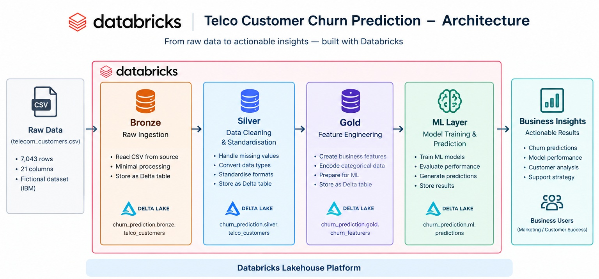

# Databricks-Customer-Churn-Prediction
An end-to-end customer churn prediction project built with Databricks, PySpark, and Delta Lake.

### Project Overview

This project uses a fictional telecom company dataset presented by IBM to build a customer churn prediction pipeline.

The goal was to go beyond simply training a machine learning model and build a workflow that reflects a practical data and ML environment.

The project follows a simple **Medallion Architecture**:

**Raw Data → Bronze → Silver → Gold → Machine Learning → Predictions & Insights**




**Bronze**

Raw CSV data is ingested into a Delta table with minimal processing.
```
churn_prediction.bronze.telco_customers
```

**Silver**

The Bronze data is cleaned and standardised.

### Key transformations include:

- Cleaning customer identifiers
- Converting TotalCharges to a numeric data type
- Handling missing TotalCharges
- Converting the churn target from Yes/No to 1/0

```
churn_prediction.silver.telco_customers
```

**Gold**

Business-oriented features are created for analysis and machine learning.

Examples include:

- Tenure in years
- Internet service indicator
- Technical support indicator
- Online security indicator
- Month-to-month contract indicator

```
churn_prediction.gold.churn_features
```

### Exploratory Analysis

The dataset contains 7,043 customers.

One of the strongest patterns observed was the difference in churn across contract types:

| Contract | Churn Rate |
|:---|:---|
| Month-to-month|	42.7% |
| One year	    | 11.3% |
| Two year	    | 2.8% |


These results show a strong association between contract type and customer churn. They should not be interpreted as evidence that contract type itself causes churn.

### Machine Learning

Two baseline classification models were developed using Spark ML:

- **Logistic Regression**
- **Random Forest**

Categorical variables were processed using **StringIndexer** and **OneHotEncoder**, followed by feature assembly with **VectorAssembler**.

### Model Results
| Model	| Accuracy | ROC-AUC | Churn Precision | Churn Recall | Churn F1 |
|:---|:---|:---|:---|:---|:---|
|Logistic Regression|	 79.70% | 0.8408 | 65.90% | 52.48% | 58.43% |
|Random Forest| 80.13% | 0.8418 | 68.46% | 49.87% | 57.70% |


The two models produced very similar ROC-AUC scores. Logistic Regression achieved higher recall for the churn class, while Random Forest achieved higher precision.

This highlights why model evaluation should consider the business objective rather than relying on accuracy alone.


### Next Steps

The project is being extended with:

- MLflow experiment tracking
- Classification threshold analysis
- Prediction outputs
- Additional data visualisations
- Workflow automation
- Further model evaluation and improvement

### Feedback

Suggestions and feedback on the pipeline, modelling approach, and Databricks implementation are welcome.
